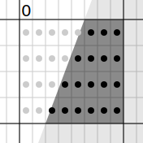
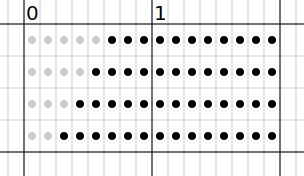
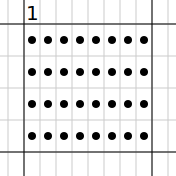

Recently I needed to write a polygon filling algorithm for a project of mine, [TinyGL](https://github.com/aykevl/tinygl). I ended up writing an algorithm that's mostly based on the A-buffer algorithm after finding [this very nice explanation of how the A-buffer algorithm works](https://bucior.com/antialising-polygon-edges-for-scanline-rendering/). You can also read [the original paper (PDF)](https://dl.acm.org/doi/pdf/10.1145/964965.808585) which I found reasonably readable (though rather old) and describes how this algorithm was used in *[Star Trek II](https://www.imdb.com/title/tt0084726/)*.

My requirements for the algorithm are as follows:

  * It must be fast! It will run on small CPUs like the Cortex-M0+ which are usually slow so antialiasing doesn't have to be perfect, it just has to be good enough so that edges look just a bit better.
  * It should not use a lot of memory. Small lookup tables are acceptable, but lookup tables larger than 1kB or so are best avoided. Also, no additional RAM should be needed while rendering a polygon as RAM is usually very limited on these small CPUs.
  * It should be able to render just a part of an image. This means that algorithms that follow an edge are inconvenient to use. Scanline based algorithms are much easier to integrate.

These requirements are actually very similar to the requirements for computers of the 80s, which were slow, typically don't have special SIMD/float instructions, and don't have a lot of memory (though often more memory than modern microcontrollers). So that's great.

Before continuing, I highly recommend reading [that blog post about the A-buffer algorithm](https://bucior.com/antialising-polygon-edges-for-scanline-rendering/). But I'll give a very short summary here as to how it works.

## The A-buffer algorithm

The core idea of this algorithm is very simple. It's actually very much like [multisample anti-alias (MSAA)](https://en.wikipedia.org/wiki/Multisample_anti-aliasing) which samples each pixel multiple times at different sub-pixel positions and averages the result. MSAA is often used in games, where aliasing is often not very visible (especially on textures) and doing full antialiasing is usually too computationally expensive.

The A-buffer algorithm samples each pixel 32 times, in an 8x4 pattern and averages the result. This is actually just a `uint32` (or `uint32_t`, or `u32`, depending on your language preferences). It's a mask: each set bit indicates the subpixel at the given position is set, while a clear bit means the subpixel is transparent. Because we only need a single color channel (the alpha channel) we only need a single mask per pixel.


The idea is now that you can clip any to-be-rendered shape to the pixel, and sample each subpixel to come up with a pixel mask. This sounds expensive, but there are various ways to do this efficiently and I'll describe one of these later. The blog post above describes how to do this using a lookup table. But to understand the algorithm, you don't need to know this, just that you can get an 8x4 bitmap cheaply to use as a mask. For example, the following figure would have a mask of `0b00000111_00001111_00011111_00111111` or `0x70f1f3f`.


The beauty of the algorithm is now that blending two pixel masks can be done like any bit operation, and is therefore incredibly fast:

  * Taking the union of two shapes is done using bitwise OR.
  * Taking the intersection of two shapes is done using bitwise AND.
  * Taking the symmetric difference of two shapes is done using bitwise XOR.

Finally, to get the resulting alpha channel value of a mask you need to sum the number of bits in the mask. The x86 architecture has a simple instruction for this: `popcount`. Unfortunately other architectures like ARM don't really have a convenient instruction like that, but there are fast algorithms to count the number of set bits and you can instruct your compiler to use the fastest way it knows using language builtins (like [`__builtin_popcount`](https://gcc.gnu.org/onlinedocs/gcc/Other-Builtins.html) in GCC/Clang, and [`bits.OnesCount32`](https://pkg.go.dev/math/bits#OnesCount32) in Go). For example, on a Cortex-M4 the number of bits can be [calculated in 13 simple arithmetic instructions](https://godbolt.org/z/Mrr6KcW61) (no branching).

## Polygon math!

I originally wanted to draw antialiased lines so I'll use a line with a particular thickness (basically a rectangle) as an example polygon:


To draw this line, we convert it to a polygon to be filled:


A polygon can be converted to a number of trapezoids that when XORed together reproduce the original polygon. Trapezoids are made by drawing the edge horizontally until it falls entirely over the right edge, like the black areas here:


In the case of a rectangle that's drawn at an angle, that's 4 trapezoids as you can see above.

You can intuitively understand that XORing these four trapezoids together results in the original polygon as follows:

 1. XORing A and B together results in a shape that follows the left side of the polygon.  
    
 2. XORing C and D together results in a shape that follows the right side of the polygon.  
    
 3. XORing the previous two shapes together results in the original polygon.  
    

The same thing works for any polygon, even those that aren't convex or that have cutouts inside them.

## Calculating masks

Now that we know how to convert the polygon into trapezoids, it's time to make use of that knowledge to calculate masks. This algorithm was partially inspired by [this paper](https://www.semanticscholar.org/paper/Scanline-Edge-flag-Algorithm-for-Antialiasing-Kallio/8f774e34b946251503e1aa5f8063e61cd4b94851) that describes a different way of doing antialiasing by sampling subpixels, though my method is more close to the A-buffer approach than that paper.

The way I've done it is by converting edges to a simple struct (in pseudocode):

```
struct polygonEdge:
    ytop
    ybottom
    xstart
    xinc
```


`ytop` and `ybottom` indicate the top and bottom edge of the trapezoid. `xstart` is the X offset from the left at the `ytop` coordinate, and `xinc` is how much `xstart` increases for every unit increment in the Y direction. Polygon edges that are entirely horizontal should be ignored altogether: they don't contribute to the polygon because they don't have a visible trapezoid.

Also, to be clear, I'm using usual screen coordinates where (0, 0) is the top left, X goes to the right and Y goes down. Sorry math people, I'm a computer person and to me a screen starts at the top left.

To calculate whether a particular point is inside or outside the trapezoid, it's possible to use a function like this:

```python
def isInsideTrapezoid(edge, x, y):
    if y < edge.ytop or y >= edge.ybottom:
        # above or below the Y coordinate
        return false
    # calculate the distance from the left side at X
    xoffset = edge.xstart + (y-edge.ytop) * edge.xinc
    # check whether x is to the right of the edge
    return x >= xoffset
```

...but this requires doing some math for every subpixel. This is expensive, and there is a much cheaper way of doing that.

## Scanline rendering

We're going to use [scanline rendering](https://en.wikipedia.org/wiki/Scanline_rendering) for rendering polygons. This means that the image is rendered one pixel row at a time from left to right, as if scanning out directly to a display.

There is a nice benefit to scanline rendering, which is that we only need to draw the trapezoids that actually intersect with the pixel. To explain this, I'm going to give a few examples.

Let's start with an empty mask:


Let's say the first pixel has a single trapezoid intersecting it. That will result in the following mask:



For the next pixel, we'll extend the horizontal sub-scanlines (remember, these trapezoids extend infinitely to the right):



Let's say the next pixel doesn't have a trapezoid intersecting with it. That means we don't need to do anything, we can just use the mask as-is!



For the next pixel we have another trapezoid intersecting with it:


XORing the bits results in the following mask:


Extending the bits then results in the following initial mask for the pixel at X=3:


This pixel still intersects with the same trapezoid as before, which looks like this:


One detail visible here is that bits are only set when that's the _first_ point after the trapezoid edge. That isn't true for the two rows at the top (the edge clearly intersects at a point to the left of the pixel), but _is_ true for the third row: the point at the first column is inside while the point to the left (in the previous pixel) wasn't inside the trapezoid. So that means the whole row needs to be set.

Put another way, while it is an optimization to only apply an edge when an edge intersects with a pixel, what's really important is whether an edge intersects with a particular subpixel row.

When the two masks are XORed together we get an almost-clear pixel again with only two subpixels set, as would expected considering how the edge intersects this pixel:


Other cases follow from here:

  * When there are two trapezoids intersecting a pixel, they should both be applied to the mask of the current pixel. Because it's XOR, ordering doesn't matter.
  * Trapezoids that end inside a subpixel should only set the bits of the subpixel rows that it covers. So pixels above or below the trapezoid should be left alone.

## Implementation

Now that we have the theory, here is how this can be implemented. Here is how to calculate the subpixel mask for a single subpixel row in a pixel. Here, `x` is the X coordinate of the pixel (an integer), and Y is the Y coordinate of the pixel, plus the subpixel row offset (0, 0.25, 0.5, or 0.75).

```python
def subpixelScanline(edge, x, y):
    if y < edge.ytop or y >= edge.ybottom:
        # above or below the Y coordinate:
        # all subpixels are unset
        return 0b0000_0000

    # Calculate the X coordinate where y intersects with the edge.
    xoffset = edge.xstart + (y-edge.ytop) * edge.xinc

    # Calculate the number of bits set in this subpixel line (assuming each
    # pixel has a width of 8 subpixels).
    bitOffset = int(xoffset * 8) - int(x) * 8

    if bitOffset < 0 or bitOffset >= 8:
        # The first bit is outside this sub-scanline.
        return 0b0000_0000

    # bitOffset is now the number of bits from the left side of the pixel.
    return (1 << (8 - bitOffset)) - 1
```

Most of the code here is what I've discussed before: checking whether the Y coordinate is inside the trapezoid and checking whether the trapezoid starts at this particular pixel. The last line is interesting thoug, as it calculates the set bits purely using arithmetic operations and is therefore very fast. In fact, on a CPU with 64-bit registers it would be trivial to extend this algorithm to use 16 colums per subpixel without a loss in performance.

Another trick I've used in my implenetation is how I've extended the current subpixel mask to a larger integer. It may seem like this requires some complicated arithmetic, but it's in fact possible to do in _two_ arithmetic operations:

```python
    mask = (mask & 0x0101_0101) * 255
```

That's a bit of magic, but you can see that it works by looking at the four rightmost bits independently:

  * For the rightmost `0x01`, multiplying it by 255 results in `0xff`.
  * For the next pixel `0x0100`, multiplying it by 255 results in `0xff00`.

...and so on for all four bytes. Essentially we're doing a kind of vector operation here, using a plain old multiply instruction. I think that's quite nifty.

## More optimizations

There are a number of other optimizations I've used, to make this as fast as possible and not spend any unnecessary cycles on antialiasing.

  * I will keep the start and end index to the slice around, so that the code only needs to iterate over edges that apply to a particular pixel. This requires keeping the edge slice sorted, and not having intersecting edges.
  * For correctness I need to start the algorithm at the leftmost edge in a scanline, but once all edges have been passed the scanline drawing loop can just stop.
  * A common case is a range of pixels that are fully set (no transparency due to antialiasing). In that case I calculate the next edge intersection on the current scanline and draw the pixels in a loop. This saves a lot of time, probably because such a loop is easy to optimize by the compiler.

## Conclusion

That's it! The code is [part of TinyGL](https://github.com/aykevl/tinygl/blob/main/gfx/polygon.go) and you are free to reuse the algorithm however you wish.

I wrote this blog post because I couldn't find much information about this subject online, except for that one blog post I mentioned before. I hope this will be useful to some people, especially when it helps them make faster and more beautiful graphics on slow hardware.
